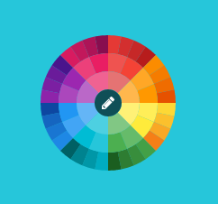

## ColorSVG

ColorSVG is a new way to allow your users to select color. It hails from the age old tradition of color wheels, but gives an exciting new twist using 100% SVG graphics. If focuses on easily providing a rich set of colors for your users to easily select, which allows you to get back to business.



### Implementation

The first step is to create an `<input />` that will hold the color. If there is a value,
it will be read automatically by ColorSVG. When a new color is selected, it will be placed in the input.
```
<input class="color-picker" name="color" />
```

It's really that simple. You can initialize the picker(s) using a jQuery object or selector string.
```
ColorSVG.init(scope, options); // default scope is input.color-picker
ColorSVG.init('.color-picker');
```
OR
```
ColorSVG.init($('.color-picker', options));
ColorSVG.init($('.color-picker'));
```

### Options

    eventHandler: myEvent(),
    current_color: null,
    size: 40,
    multiplier: 8,
    row_width: 20,
    animation_speed: 250,
    animation_type: 'backout' // options: backin, backout, bounce, easein, easeinout, easeout, linear
    

### Exemple

    function myEvent() {
        var colorSelectedHex = ColorSVG.getColorCurrent();
        console.log(colorSelectedHex);
        $('body').css("background-color",'#'+colorSelectedHex);
    }
    $(window).load(function() {
        ColorSVG.init(null,{
            eventHandler: myEvent
        });
    });

### Contributing

To contribute you must have Node and Gulp installed on your system.

**Compiling:**

```
npm install
bower install
gulp
```
